# 📈 CopyTrade — AI-Powered Discord Signal Copier

<div align="center">
  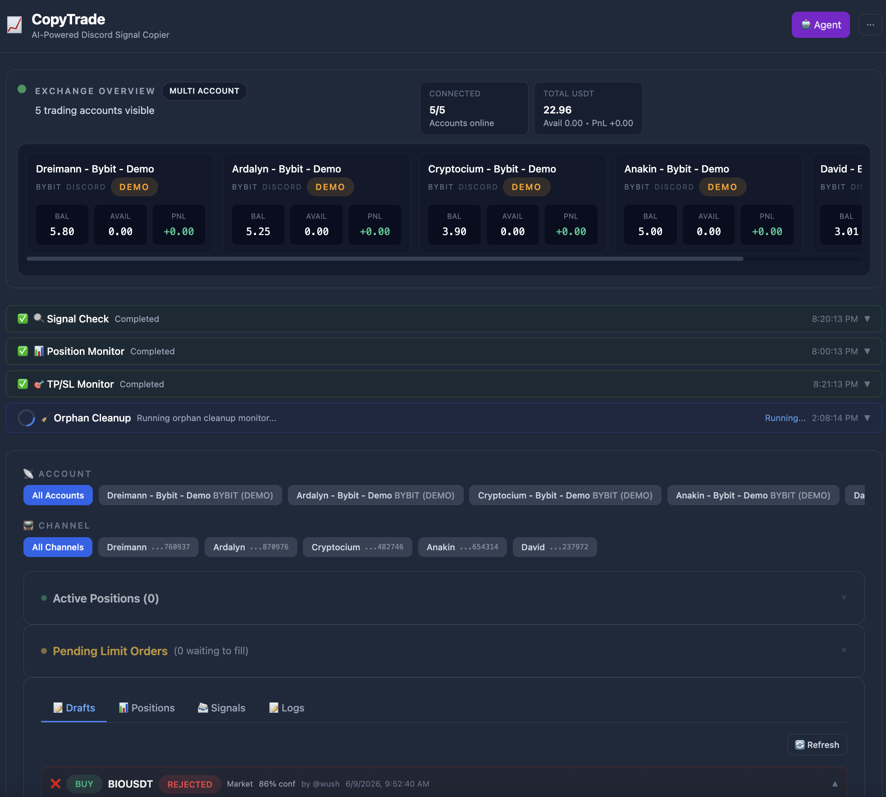
</div>

<br />

An automated, intelligent trading system that fetches signals from Discord and Telegram channels, parses them with cutting-edge AI, and executes trades across multiple exchanges (MEXC, Binance, Bybit, etc.). Built with a modern tech stack as a monorepo, it features a comprehensive Next.js dashboard and a robust Express backend for background jobs.

---

## ✨ Features

- **Multi-Source Integration**: Seamlessly fetches and aggregates trading signals from multiple sources including Discord and Telegram.
- **AI Signal Parsing**: Utilizes top-tier AI models (OpenAI, GLM, Kimi, Patungin) to understand natural language signals and convert them into structured trading actions.
- **Dual Trading Modes**:
  - 🤖 **Auto Mode**: Execute parsed signals directly onto the exchange.
  - 👆 **Manual Mode**: Signals are stored as drafts for manual review, giving you full control to accept or reject them.
- **Multi-Exchange Integration**: Connects via API to place Futures orders on MEXC, Binance, Bybit, and others, supporting complex risk management and leverage.
- **Smart Position Monitoring**: AI-powered position monitor runs every 30 minutes to evaluate open positions and intelligently decide whether to update Take Profit/Stop Loss or close the trade.
- **Comprehensive Dashboard**: Real-time web application to manage everything from signals and active positions to advanced settings.

---

## 🏗 Architecture & Flow

The system is designed as a modular monorepo, split into a **Frontend Client** and a **Backend Server**.

### 1. The Core Architecture

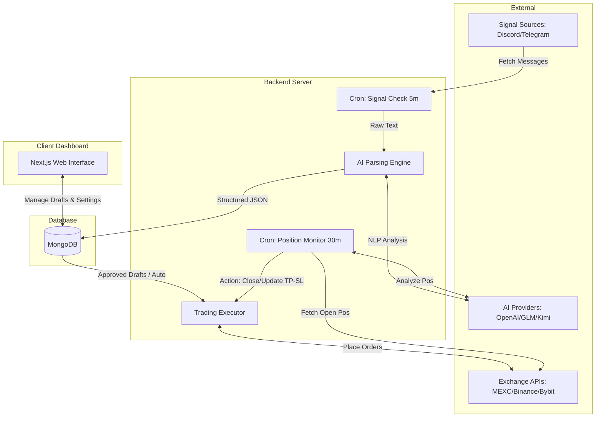
```mermaid
graph TD
    subgraph External
        A[Signal Sources: Discord/Telegram]
        EXCH[Exchange APIs: MEXC/Binance/Bybit]
        AI[AI Providers: OpenAI/GLM/Kimi]
    end

    subgraph Backend Server
        C1[Cron: Signal Check 5m]
        C2[Cron: Position Monitor 30m]
        Parser[AI Parsing Engine]
        Exec[Trading Executor]
    end

    subgraph Database
        DB[(MongoDB)]
    end

    subgraph Client Dashboard
        UI[Next.js Web Interface]
    end

    A -->|Fetch Messages| C1
    C1 -->|Raw Text| Parser
    Parser <-->|NLP Analysis| AI
    Parser -->|Structured JSON| DB
    
    UI <-->|Manage Drafts & Settings| DB
    
    DB -->|Approved Drafts / Auto| Exec
    Exec <-->|Place Orders| EXCH
    
    C2 -->|Fetch Open Pos| EXCH
    C2 <-->|Analyze Pos| AI
    C2 -->|Action: Close/Update TP-SL| Exec
```

### 2. The Complete Flow

1. **Signal Ingestion**: Every 5 minutes, the backend pulls the latest messages from configured Discord and Telegram channels.
2. **AI Interpretation**: Unstructured chat messages (e.g., *"LONG BTC 65k target 67k sl 64k"*) are processed by the AI layer into a rigid JSON structure specifying Action, Symbol, Entry Price, TP/SL, and Leverage.
3. **Execution Routing**:
   - In **Manual Mode**, the parsed signal is saved as a **Draft**. The user can review the AI's interpretation on the dashboard and click "Accept" to execute.
   - In **Auto Mode**, the system validates risk parameters and immediately executes the trade.
4. **Position Maintenance**: Every 30 minutes, an AI monitor checks the status of open positions against current market trends and original signal intent, automatically managing Take Profits, Stop Losses, or early closures.

### 3. Design Patterns Used

To ensure high maintainability and modularity, the core system implements several proven software design patterns:

- **Domain-Driven Design (DDD) & Monorepo**: The codebase is strictly decoupled into a Presentation Layer (`client`), Background/API Layer (`server`), and Domain Core (`shared`).
- **Strategy Pattern (AI Providers)**: Implemented in `shared/src/lib/ai`. This pattern allows seamless switching between various AI backends (OpenAI, GLM, Kimi, Patungin) without modifying the central parsing logic. Every provider adheres to a unified contract.
- **Factory Method Pattern (Exchange & Source Integration)**: Located at `shared/src/lib/exchange/ExchangeFactory.ts` and `shared/src/lib/source/SourceFactory.ts`. This dynamically instantiates the correct exchange adapter (MEXC, Binance, Bybit, Paper Trading) and signal source (Discord, Telegram) based on the user's settings, decoupling the core logic from specific SDKs.
- **Repository Pattern**: Database interactions are fully abstracted through shared Mongoose models, centralizing data-access logic and preventing queries from leaking into background cron controllers.
- **Singleton Pattern**: Applied to handle persistent connections (like the MongoDB connection and the Discord bot client), ensuring that the backend worker does not spawn duplicate intensive resources.

---

## 📸 System Modules & Gallery

### 📊 Dashboard Overview
Provides a bird's-eye view of your trading performance, recent signals, drafts, and system health.


### 📡 Signal Parsing & Drafts
Watch as chaotic Discord messages are parsed into clean, actionable data. Review them in the drafts section before execution.
<p align="center">
  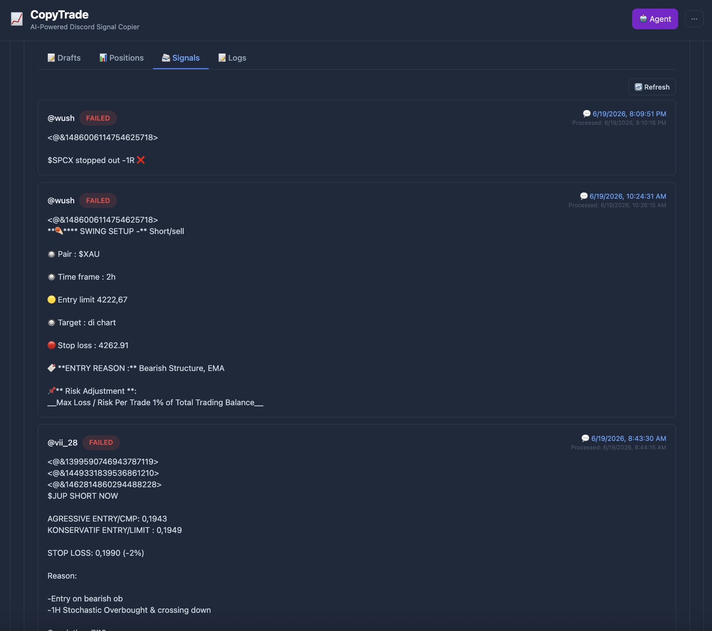
  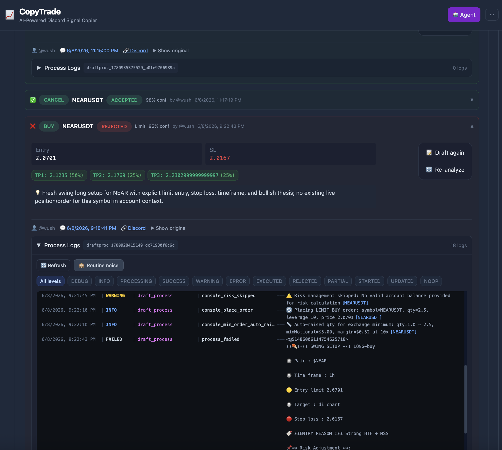
</p>

### 📈 Position Monitoring
Track all open positions with real-time PnL, margin details, and active TP/SL targets.
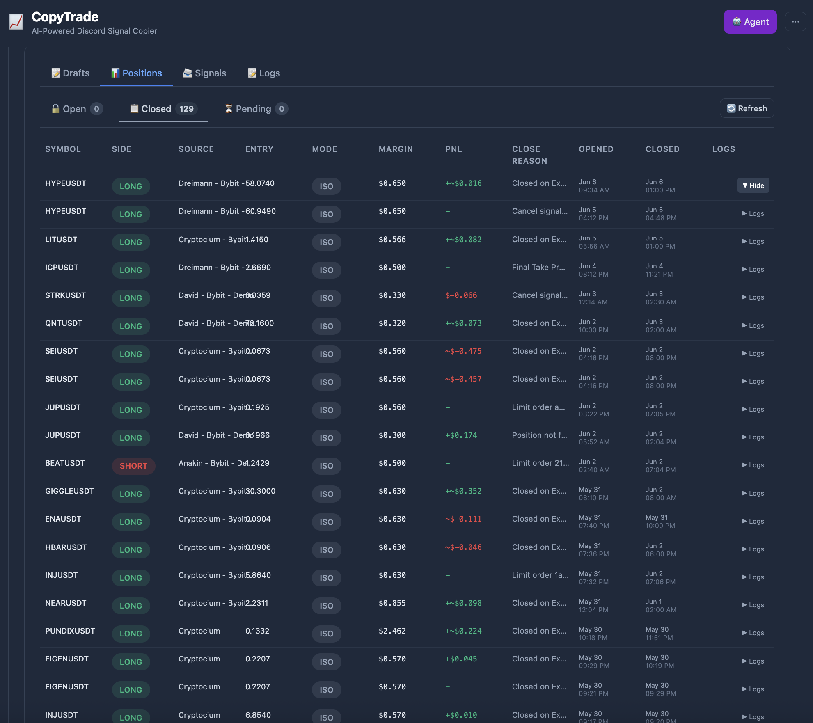

### 🤖 Agentic AI Capabilities
This system goes beyond basic static logic by leveraging autonomous AI agents to manage your trades and interact with you.
- **Model Context Protocol (MCP) & Extensive Tooling**: The AI is powered by a robust Tool-Calling architecture giving it full read/write access to the system context. Through an extensive suite of tools, the agent can autonomously query `account_market` data, execute `orders_trading`, manage `drafts`, analyze `database_logs`, and even adjust `settings_risk` on the fly.
- **Agentic Position Monitor**: A background AI agent constantly evaluates open positions against live market trends. It autonomously reasons whether to hold, adjust Stop-Loss/Take-Profit, or close a trade early to maximize profit or minimize loss.
- **Interactive Agentic Chat**: A built-in AI assistant interface that allows you to converse with your trading bot. You can simply ask the AI to "pull the latest error logs", "check my current Binance balance", or "summarize my trading performance today".
<p align="center">
  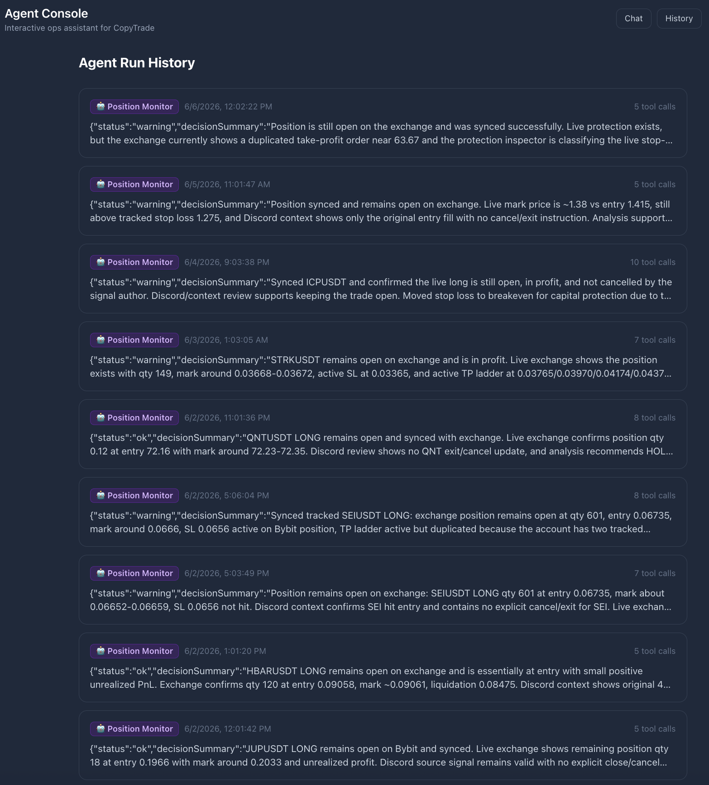
  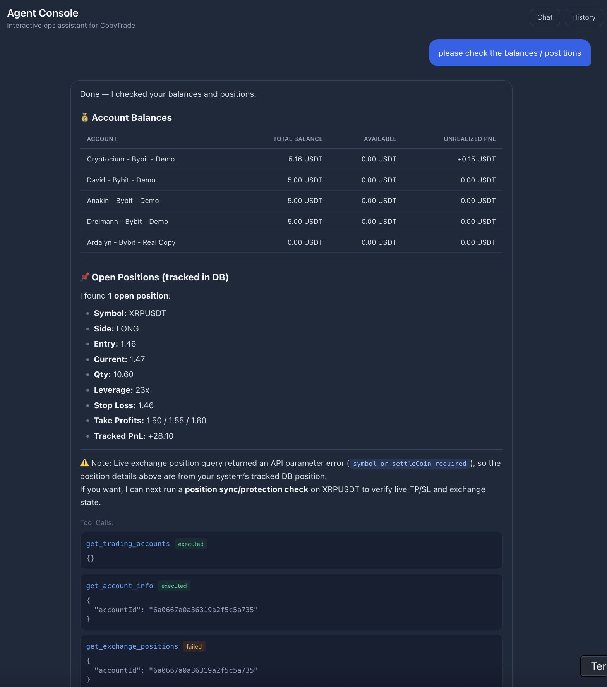
</p>

### 📋 Transparency & Logs
Full transparency into system operations is essential for automated trading.
- **Execution Actions (`actions.png`)**: Specific records detailing order executions, filled prices, TP/SL triggers, and exchange responses.
- **System Logs (`logs.png`)**: A comprehensive audit trail of all background processes. Features built-in **Log Levels (Info, Warn, Error, Debug)** allowing you to easily filter and diagnose raw API responses, AI reasoning delays, and system health status.
<p align="center">
  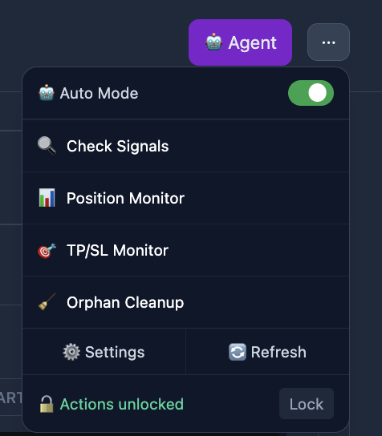
  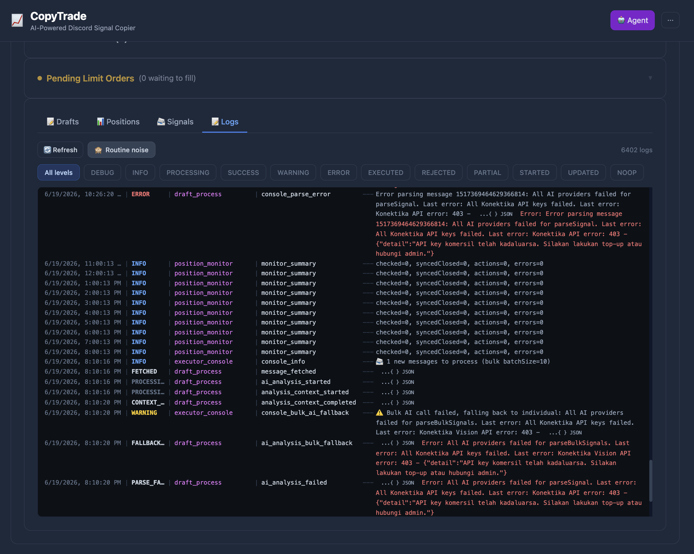
</p>

### ⚙️ Extensive Configuration & System Settings
The application provides a highly granular settings dashboard to fine-tune every aspect of the trading bot:

**1. Risk Management**
Control your capital exposure by defining global rules such as Default Leverage, Position Sizing strategy (Fixed USDT vs % of Margin), Maximum Daily Loss Limits, and Minimum AI Confidence Thresholds.
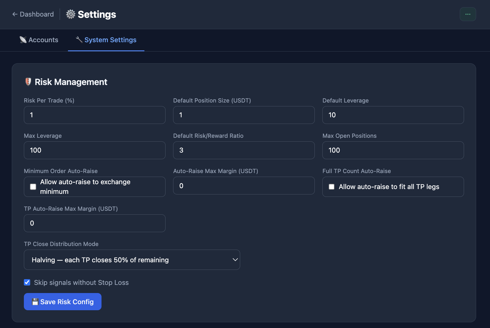

<details>
<summary><b>View More Features & Configurations</b></summary>
<br>

**2. Trader Accounts & Multi-Exchange Support**
Manage multiple exchange bindings in one place. Securely input API Keys, Secrets, and Passphrases to seamlessly switch execution endpoints between MEXC, Binance, Bybit, or Paper Trading.
<p align="center">
  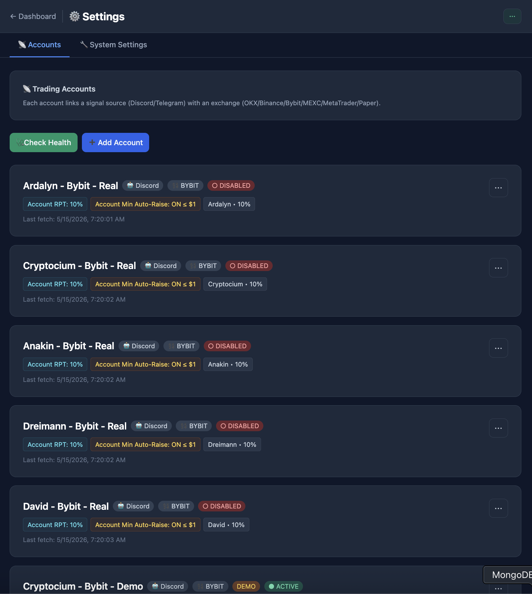
  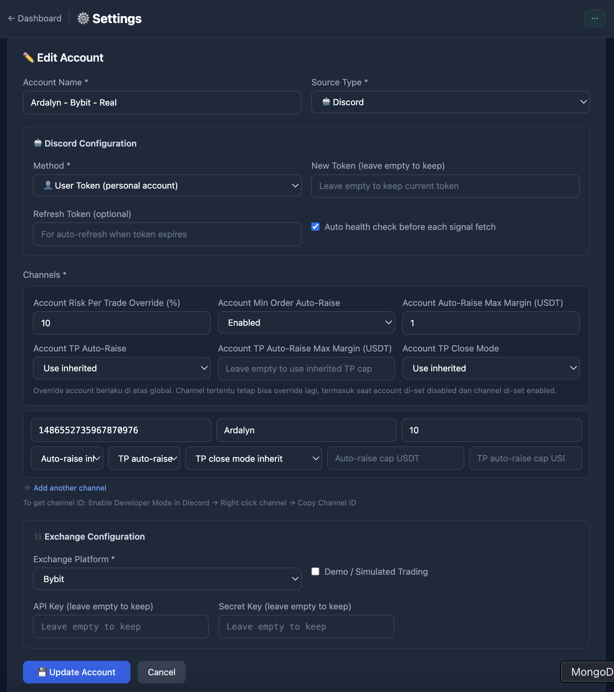
</p>

**3. Signal Configurations**
Select exactly where your signals come from. Register Discord Guild IDs, Channel IDs, and Telegram chat IDs. You can even map specific channels to dedicated AI models.
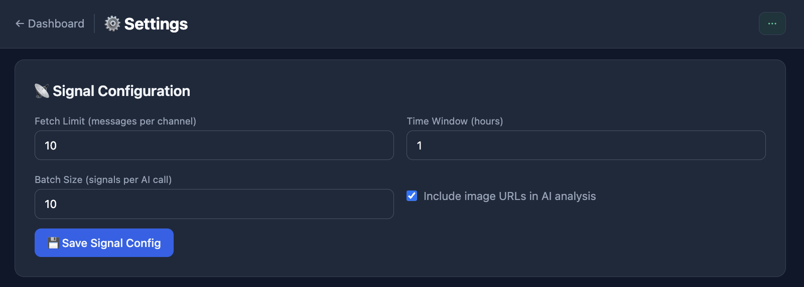

**4. Cron Job Settings**
Manage the heartbeat of your automated system. Adjust the intervals for signal polling (e.g., fetch new messages every 5 minutes) and position monitoring loops (e.g., check open trades every 30 minutes).
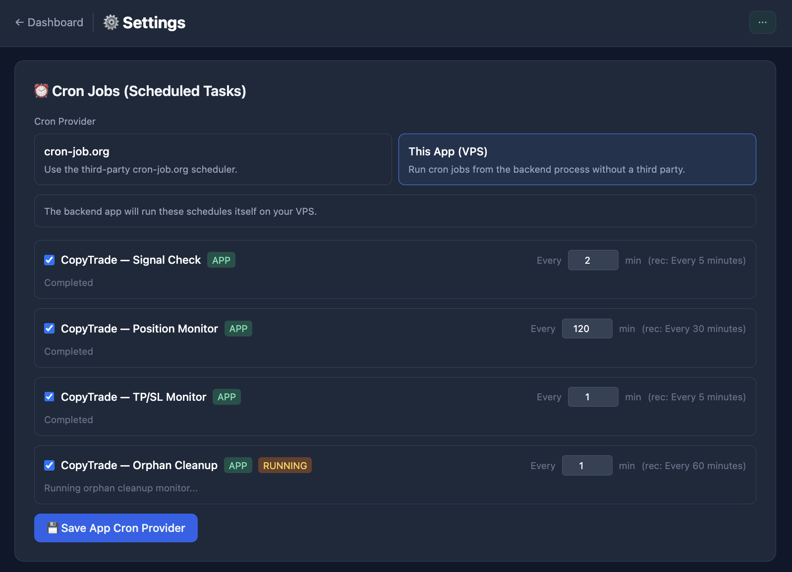

**5. Proxy Configurations**
Built-in support for HTTP/SOCKS5 proxies. This is crucial for bypassing regional API restrictions (like Telegram in certain countries) or preventing IP rate-limits from exchanges.
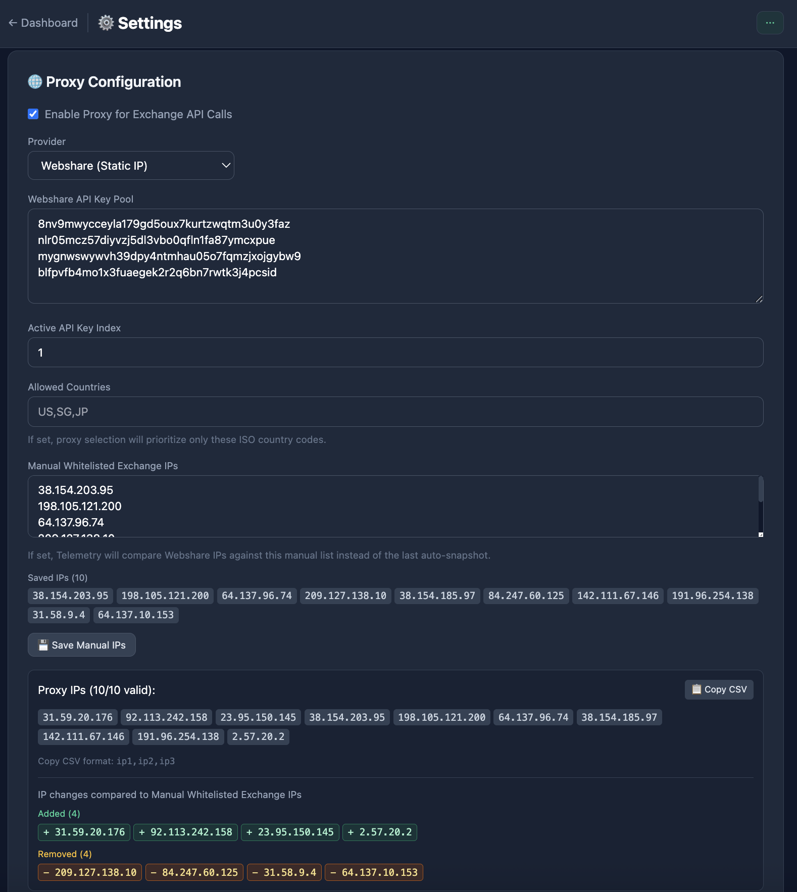

**6. System Maintenance & Cleanup**
Keep your MongoDB lightweight and fast. Configure auto-deletion policies for old logs/drafts, and perform safe hard-resets of the database when transitioning strategies.
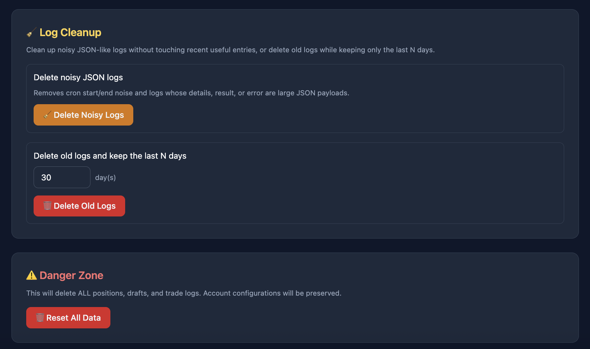

</details>

### 🔒 Security & Action Authorization
To protect your trading capital from accidental or malicious modifications, the entire system is guarded by a strict **Action Lock (Padlock)** mechanism.
- By default, both the dashboard and the Agentic AI operate in **Read-Only Mode**. You can freely view logs, check balances, and monitor positions safely.
- To execute trades, save configurations, or allow the Agentic AI to take write-actions on your behalf, you must explicitly "Unlock the Padlock" by providing your master action password. This ensures you remain in complete control of when the system (or the AI) is allowed to interact with live exchange environments.

---

## 🛠 Tech Stack

**Frontend (Client)**
- **Framework**: Next.js (App Router)
- **Styling**: Tailwind CSS + Shadcn UI
- **Icons**: Lucide React

**Backend (Server)**
- **Framework**: Express.js
- **Cron Management**: Native cron endpoints
- **Exchange Integration**: MEXC Futures API
- **Discord Bot**: discord.js

**Shared Core**
- **Language**: TypeScript
- **Database**: MongoDB & Mongoose
- **AI Integration**: OpenAI SDK, Anthropic SDK, Google Generative AI
- **Package Manager**: pnpm (Monorepo setup)

---

## 🚀 Getting Started

### 1. Prerequisites
- Node.js >= 20.x
- `pnpm` package manager
- MongoDB Instance (Atlas or Local)
- Discord Bot Token & Developer Application
- MEXC API Key (with Futures enabled)

### 2. Installation
Clone the repository and install all workspace dependencies:
```bash
git clone https://github.com/yourusername/copytrade.git
cd copytrade
pnpm install
```

### 3. Environment Setup
Copy the example environment file and fill out your configuration:
```bash
cp .env.example .env
```
*Make sure to configure your `DISCORD_TOKEN`, `MEXC_API_KEY`, `OPENAI_API_KEY`, and `DATABASE_URL`.*

### 4. Running the Application
Start both the Next.js client and the Express backend concurrently in development mode:
```bash
pnpm run dev
```

- **Dashboard**: Access via [http://localhost:3000](http://localhost:3000)
- **Backend API**: Runs automatically on the configured port for background tasks.
